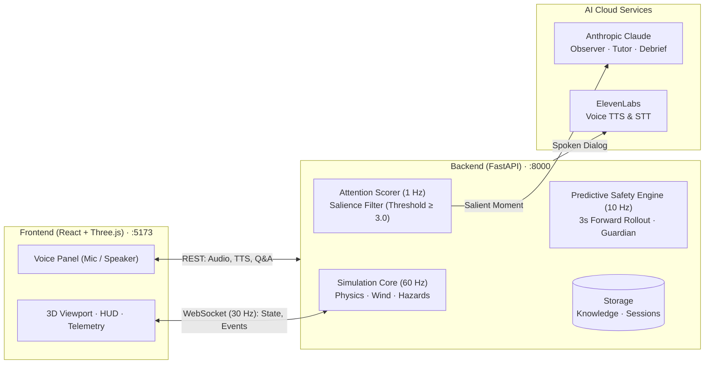
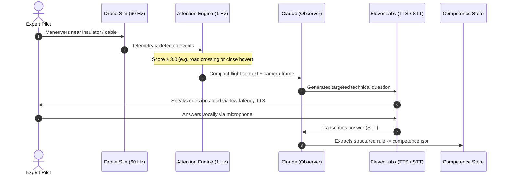

# Power Line AI Apprentice — Pipeline Architecture

An industrial Ground Control Station (GCS) and digital twin simulation for autonomous capture of expert drone pilot know-how, predictive collision avoidance, and novice coaching.

---

## 1. System Overview



### Two Operational Modes:
1. **Expert Mode (AI Learns)**: The AI passively monitors flight telemetry. When a notable maneuver or violation occurs, it triggers a spoken inquiry to capture the pilot's implicit heuristic, storing it in the **Competence Grid** (10 tasks, 29 slots).
2. **Novice Mode (AI Coaches & Protects)**: The AI coaches novice operators using captured rules, displays predictive hazard vectors, and arms the **MPC Guardian** to take over controls if an imminent crash is projected.

---

## 2. Core Execution Loops

| Loop | Rate | Primary Responsibilities |
|---|---|---|
| **Physics & Sim** | **60 Hz** | Flight dynamics, aerodynamics, wind drift/gusts, obstacle collision detection (`backend/sim/drone.py`). |
| **Safety & MPC** | **10 Hz** | 3-second kinematic trajectory rollout across 9 maneuver branches. Predicts cable, tower, and road conflicts (`backend/sim/predictor.py`). |
| **Attention Engine** | **1 Hz** | Local heuristic scoring of flight salience (speed drops, proximity, road crossings). Triggers Claude only when score $\ge 3.0$ (`backend/llm/attention.py`). |
| **Telemetry Broadcast** | **30 Hz** | Streams real-time drone coordinates, hazard clearances, and active tasks over WebSocket `/ws`. |

---

## 3. The AI & Voice Pipeline



### Prompt Caching & Token Optimization
- **Cached System Prompts**: The full competence grid and rules (~4.6k tokens) are tagged with `cache_control: {"type": "ephemeral"}` in Anthropic requests. Subsequent checks read from cache at a **90% discount**.
- **Local Attention Filter**: Claude is called only when an event exceeds the salience threshold ($Score \ge 3.0$), reducing API calls by over 80%.

---

## 4. Formal Model Predictive Control (MPC) Formulation

The predictive safety architecture is implemented as a **Sampling-based Receding Horizon Model Predictive Controller** operating at $f_{\text{mpc}} = 10\text{ Hz}$ over a finite prediction horizon $T = 3.0\text{ s}$ discretized into $N = 60$ steps ($\Delta t = 0.05\text{ s}$).

### 4.1 State Space & System Dynamics
The system state vector at prediction step $i \in \{0, \dots, N\}$ is defined as:
$$x_i = \begin{bmatrix} p_i & v_i & a_i^{\text{thrust}} & \psi_i & \dot{\psi}_i & I_i \end{bmatrix}^T \in \mathbb{R}^{14}$$

Where $p_i \in \mathbb{R}^3$ is the inertial position, $v_i \in \mathbb{R}^3$ the velocity vector, $a_i^{\text{thrust}} \in \mathbb{R}^3$ the rotor acceleration, $\psi_i, \dot{\psi}_i$ the heading dynamics, and $I_i \in \mathbb{R}^3$ the velocity loop integral state.

For each candidate maneuver $k$, the discrete-time forward state transition $x_{i+1} = f(x_i, u^{(k)})$ models closed-loop PI autopilot response, attitude lag, and aerodynamic wind drag:

1. **Velocity Error & PI Command**:
   $$e_i = v_{\text{target}}^{(k)} - v_i, \quad I_{i+1} = \text{clamp}(I_i + K_I \odot e_i \Delta t, -I_{\max}, I_{\max})$$
   $$a_{\text{cmd}, i} = K_P \odot e_i + I_i \quad \text{subject to horizontal saturation } \|a_{\text{cmd}, i}^{xy}\| \le a_{\max}^{xy}$$

2. **First-Order Attitude Lag**:
   $$a_{i+1}^{\text{thrust}} = a_i^{\text{thrust}} + \alpha_{\text{att}} (a_{\text{cmd}, i} - a_i^{\text{thrust}}), \quad \alpha_{\text{att}} = 1 - (1 - \Delta t_{\text{sim}}/\tau_{\text{att}})^{\Delta t / \Delta t_{\text{sim}}}$$

3. **Aerodynamic Drag & Translational Kinematics**:
   $$v_{\text{air}, i} = v_i - w(z_i), \quad F_{\text{drag}, i} = -k_d \|v_{\text{air}, i}\| v_{\text{air}, i}$$
   $$v_{i+1} = v_i + (a_i^{\text{thrust}} + F_{\text{drag}, i}) \Delta t, \quad p_{i+1} = p_i + v_{i+1} \Delta t$$

### 4.2 Candidate Action Library $\mathcal{U}$
Instead of continuous non-convex trajectory optimization, the MPC evaluates a discrete bank of $K = 9$ kinematically valid control branches:
$$\mathcal{U} = \left\{ \text{pilot}, \text{slow}, \text{brake}, \text{climb}, \text{brake\_climb}, \text{back\_off}, \text{strafe\_left}, \text{strafe\_right}, \text{brake\_descend} \right\}$$

### 4.3 Objective Function (Cost Minimization)
The optimal trajectory $u^* \in \mathcal{U}$ minimizes a multi-objective cost functional $J(u^{(k)})$:
$$u^* = \arg\min_{u^{(k)} \in \mathcal{U}} \left[ J_{\text{effort}}(u^{(k)}) + \sum_{i=1}^{N} \gamma_i \Big( C_{\text{danger}}(p_i^{(k)}) + C_{\text{caution}}(p_i^{(k)}) \Big) + C_{\text{crash}}(u^{(k)}) + C_{\text{terminal}}(u^{(k)}) + C_{\text{road}}(p_i^{(k)}) \right]$$

- **Time Discount Factor**: $\gamma_i = 1.0 - 0.5 \frac{i}{N}$ (near-term hazard proximity is penalized higher than distant projections).
- **Hazard Clearance Penalties**: For hazards $h \in \{\text{cable}, \text{tower}, \text{tree}\}$ with Euclidean clearance $d_i^h = \text{dist}(p_i, \mathcal{H}_h)$:
  $$C_{\text{danger}}(p_i) = 30.0 \sum_h \max\left(0, d_{\text{danger}}^h - d_i^h\right)^2 \cdot \mathbf{1}_{\text{closing}}$$
  $$C_{\text{caution}}(p_i) = 2.0 \sum_h \max\left(0, d_{\text{caution}}^h - d_i^h\right)^2 \cdot \mathbf{1}_{\text{closing}}$$
  *(Margins: $d_{\text{danger}}^{\text{cable}} = 2.0\text{m}$, $d_{\text{caution}}^{\text{cable}} = 4.0\text{m}$, $d_{\text{danger}}^{\text{struct}} = 1.5\text{m}$, $d_{\text{caution}}^{\text{struct}} = 3.0\text{m}$)*.
- **Catastrophic Crash Barrier**: $C_{\text{crash}} = 1000 + 500 \left(1 - \frac{i_{\text{crash}}}{N}\right)$ if $d_i^{\text{cable}} < 0.45\text{m}$ or $d_i^{\text{struct}} < 0.35\text{m}$.
- **Terminal Lookahead**: $C_{\text{terminal}} = 300$ if post-horizon projected velocity leads to an unavoidable collision within $1.5\text{ s}$ beyond $T$.
- **Control Deviation Effort**: $J_{\text{effort}} \in [0.0, 4.5]$ penalizes control deviations unless required for hazard mitigation (prioritizes pilot intent).

### 4.4 Receding Horizon Safety Interlock (Guardian)
At every execution cycle ($10\text{ Hz}$):
1. **Safety Forecast**: If $u^{(0)} = \text{pilot}$ contains a predicted conflict with $t_{\text{crash}} \le 1.6\text{ s}$, the state enters **Imminent Collision Risk**.
2. **Autonomous Override**: The Guardian disengages manual stick inputs and applies $u^* = \arg\min J(u^{(k)})$ (typically `brake_climb` or `back_off`) for a minimum dwell time of $\tau_{\text{hold}} = 0.6\text{ s}$ until safety envelope margins are restored.

---

## 5. Storage & Knowledge Structure

All flight sessions and acquired knowledge reside under `data/`:

```text
data/
├── knowledge/
│   ├── competence.json      # Structured rulebook (29 competence slots across 10 tasks)
│   ├── episodes.jsonl       # Task history and recurring flight habits
│   └── knowledge.md         # Human-readable markdown reference for pilots & tutor
├── sessions/<session_id>/
│   ├── telemetry.jsonl      # 10 Hz flight telemetry recording
│   ├── dialog.jsonl         # Q&A transcript with timestamps
│   └── summary.json         # Automated debrief metrics and scores
└── comparisons/             # Multi-session comparison reports (Expert vs. Novice)
```

---

## 6. Quick Start & Execution

### Environment Setup (`.env`)
```bash
ANTHROPIC_API_KEY=sk-ant-...
ELEVENLABS_API_KEY=sk_...
ELEVENLABS_VOICE_ID=21m00Tcm4TlvDq8ikWAM   # Rachel (or custom voice)
OBSERVER_MODEL=claude-haiku-4-5-20251001   # Fast, cost-efficient observer
TUTOR_MODEL=claude-haiku-4-5-20251001
DEBRIEF_MODEL=claude-sonnet-5-5            # High-capability debrief analysis
```

### Launch Services
1. **Backend Server** (Terminal 1):
   ```bash
   source .venv/bin/activate
   uvicorn backend.server:app --reload --port 8000
   ```
2. **Frontend UI** (Terminal 2):
   ```bash
   cd frontend
   npm run dev
   ```
3. Open `http://localhost:5173` in your browser.
