# Power Line AI Apprentice — the complete pipeline

One document to understand the whole system: every process, loop, agent, API key, message and file, from the pilot's keyboard to the knowledge base and back.

- It describes the code as committed in `30bba6e` ("improved the ui and ai part").
- File references are relative to the repo root.
- Diagrams are written in Mermaid. They render on GitHub, and in VS Code with the "Markdown Preview Mermaid Support" extension.

---

## Contents

1. [The system in one picture](#1-the-system-in-one-picture)
2. [Running it: processes, ports, loops](#2-running-it-processes-ports-loops)
3. [API keys and configuration](#3-api-keys-and-configuration)
4. [Who talks to whom](#4-who-talks-to-whom)
5. [The agents](#5-the-agents)
6. [The simulation core (60 Hz)](#6-the-simulation-core-60-hz)
7. [Predictive safety (MPC) and the Guardian](#7-predictive-safety-mpc-and-the-guardian)
8. [Expert mode: from a flight to a rule](#8-expert-mode-from-a-flight-to-a-rule)
9. [The knowledge model](#9-the-knowledge-model)
10. [Novice mode: coaching and protection](#10-novice-mode-coaching-and-protection)
11. [Debrief and comparison](#11-debrief-and-comparison)
12. [Frontend](#12-frontend)
13. [Data on disk](#13-data-on-disk)
14. [Every rate, threshold and timeout](#14-every-rate-threshold-and-timeout)
15. [Cost control](#15-cost-control)
16. [When things fail](#16-when-things-fail)
17. [Tests](#17-tests)
18. [Leftovers and known gaps](#18-leftovers-and-known-gaps)
19. [Glossary](#19-glossary)

---

## 1. The system in one picture

A pilot flies a simulated inspection drone along a high-voltage line, in the browser. The backend simulates the drone, predicts its next 3 seconds, and runs the AI in one of two modes:

- **Expert mode: the AI learns.**
  - An *apprentice* watches the expert fly and decides locally which moments are worth a question.
  - It asks one question out loud, listens to the spoken answer, and stores it as a reusable rule in a **competence grid** (10 tasks, 29 slots).
  - On later flights it checks whether the expert still flies by those rules.
- **Novice mode: the AI coaches.**
  - A *tutor* coaches a novice with the rules the expert taught.
  - A **model-predictive safety system** warns the novice *before* a danger.
  - A **Guardian** takes the sticks for a moment when a crash is imminent.

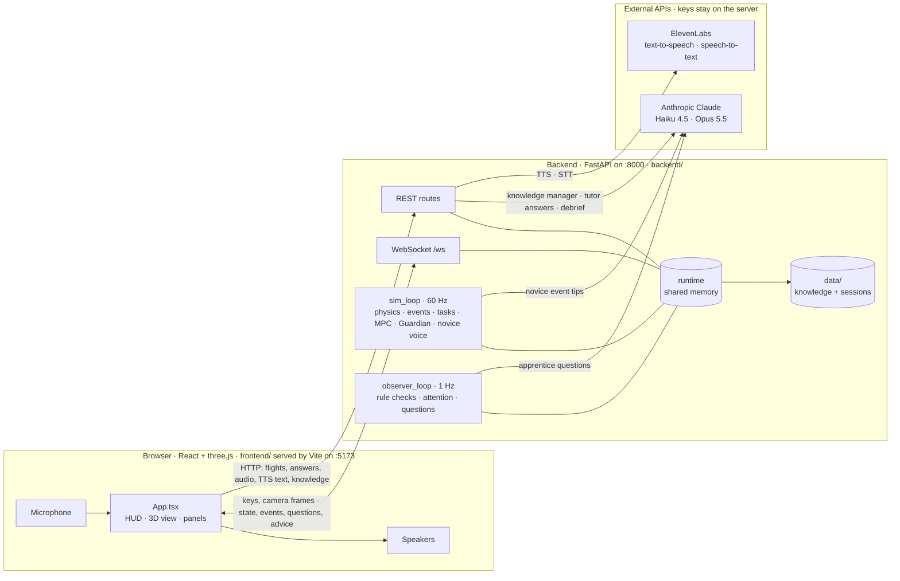

The learning loop across flights, which is the product idea in one diagram:

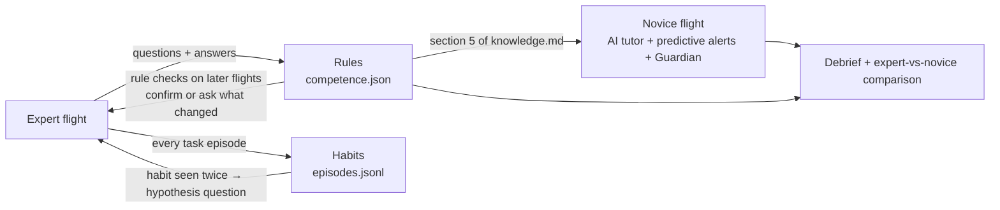

---

## 2. Running it: processes, ports, loops

| Process | Command (from the repo root) | Port | What runs inside |
|---|---|---|---|
| Backend | `uvicorn backend.server:app --reload --port 8000` (with `.venv` active) | 8000 | FastAPI app. The `lifespan` hook in [backend/server.py](backend/server.py) starts two background tasks: `sim_loop` and `observer_loop` |
| Frontend | `cd frontend && npm run dev` | 5173 | Vite dev server for the React app |
| Browser | open `http://localhost:5173` | — | The app. It connects to `ws://localhost:8000/ws` and calls `http://localhost:8000/...` |

**One shared world.** [backend/core/state.py](backend/core/state.py) holds a single module-level object, `runtime`. It contains the scene, the drone, the predictor, the flight log, every AI module and every flag. So:
- there is one flight at a time;
- every open browser tab sees, and steers, the same drone.

**One event loop.** Everything runs in uvicorn's single asyncio event loop:

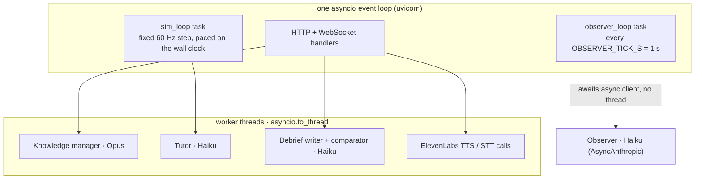

- **Blocking calls run in threads.** The synchronous Anthropic client (`LLMClient`) and the ElevenLabs HTTP client run in worker threads, so the 60 Hz simulation never waits for an AI.
- **The observer is async.** It uses `anthropic.AsyncAnthropic` and is awaited directly.
- **Simulated time is real time.** `sim_loop` runs fixed 1/60 s steps. If it falls behind, it runs up to 4 catch-up steps, then drops the backlog.

---

## 3. API keys and configuration

### 3.1 Where the keys go

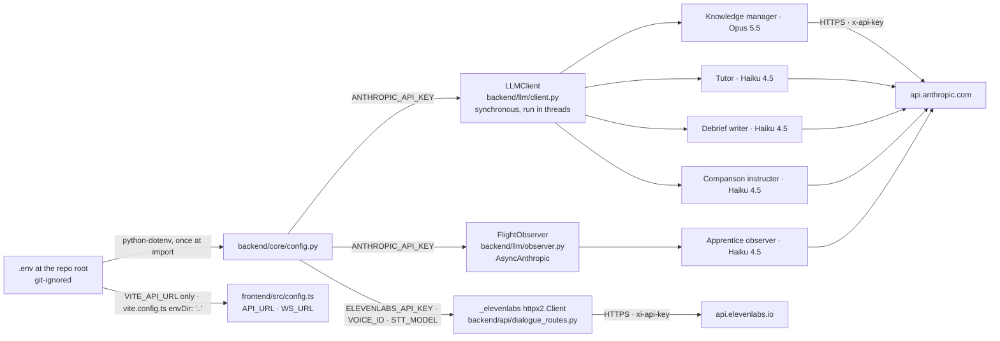

### 3.2 Every variable

| Variable | Default | Read in | Used for | If missing |
|---|---|---|---|---|
| `ANTHROPIC_API_KEY` | `""` | [config.py](backend/core/config.py) → `LLMClient`, `FlightObserver` | Every Claude call | No apprentice questions ("Ask now" → 503). Answers are not stored (`rejected` + `error`). The tutor uses rule-based tips. The debrief and comparison use deterministic text |
| `ELEVENLABS_API_KEY` | `""` | config.py → `_elevenlabs` in [dialogue_routes.py](backend/api/dialogue_routes.py) (header `xi-api-key`) | Text-to-speech, speech-to-text | `/elevenlabs/tts` → 503, and the browser falls back to its built-in `speechSynthesis` voice. Voice answers and voice questions → 503: type instead |
| `ELEVENLABS_VOICE_ID` | `21m00Tcm4TlvDq8ikWAM` | dialogue_routes.py | The voice of the apprentice and the tutor | Default voice |
| `ELEVENLABS_STT_MODEL` | `scribe_v2` | dialogue_routes.py | Speech-to-text model | — |
| `OBSERVER_MODEL` | `claude-haiku-4-5` | [observer.py](backend/llm/observer.py) | Apprentice questions | — |
| `TUTOR_MODEL` | `claude-haiku-4-5` | [advisor.py](backend/llm/advisor.py) | Novice tips and answers | — |
| `DEBRIEF_MODEL` | `claude-haiku-4-5` | [summarizer.py](backend/llm/summarizer.py), [comparator.py](backend/llm/comparator.py) | Debrief and comparison prose | — |
| *(code constant)* `DEFAULT_MODEL` | `claude-opus-5-5` | [client.py](backend/llm/client.py) | Knowledge manager | Not configurable by env |
| `OBSERVER_TICK_S` | `1.0` | [api/observer.py](backend/api/observer.py) | Period of the local attention model | — |
| `OBSERVER_INTERVAL_S` | `4.0` | api/observer.py | Minimum seconds between two observer LLM calls | — |
| `OBSERVER_WINDOW_S` | `5.0` | flight log context | Seconds of detailed telemetry sent to the observer | — |
| `QUESTION_COOLDOWN_S` | `15.0` | api/observer.py | Minimum seconds between two questions | — |
| `OBSERVER_FRAME_MAX_AGE_S` | `5.0` | api/observer.py | Older camera frames are not sent | — |
| `UNANSWERED_QUESTION_TIMEOUT_S` | `30.0` | api/observer.py | An unanswered question stops blocking new ones after this | — |
| `ROBOT_APPRENTICE_DATA_DIR` | `<repo>/data` | config.py | Where knowledge and sessions are stored. The tests point it to a temporary folder | — |
| `VITE_API_URL` | `http://localhost:8000` | [frontend/src/config.ts](frontend/src/config.ts) | Backend URL for REST; the WS URL is derived from it (`http`→`ws`, `+ /ws`) | Local default |

### 3.3 Rules to remember

- **Restart after editing `.env`.** Keys are read once, when `config.py` is imported, so restart `uvicorn` after any change.
- **One client per agent.** Clients are created when `runtime` is built: one Anthropic client per agent object. The ElevenLabs client is created when `dialogue_routes.py` is imported.
- **The browser never sees a key.** It only receives `VITE_API_URL`. Every `VITE_*` variable is compiled into the public JavaScript bundle, so never give a secret a `VITE_` prefix.
- **`.env` is git-ignored.** For deployment, [render.yaml](render.yaml) declares the same keys with `sync: false`, which means you type them into the Render dashboard. It deploys the backend on Python 3.12.7 and the frontend as a static site.

---

## 4. Who talks to whom

### 4.1 Allowed connections

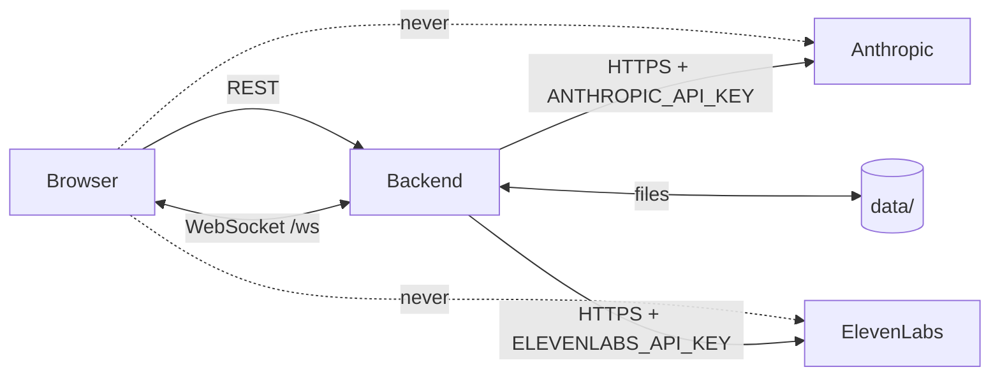

- The browser only ever talks to the backend.
- Anthropic and ElevenLabs never call back: every call is a request/response started by the backend.
- AI agents never call each other. They communicate through shared memory and files, as shown in §4.5.

### 4.2 Communication matrix

| From → To | Channel | Content | When |
|---|---|---|---|
| Browser → Backend | WS `keys` | Set of held keys | On every key down/up |
| Browser → Backend | WS `frame` | JPEG of the 3D canvas, ≤ 768 px wide, quality 0.7 | Every 2 s |
| Backend → Browser | WS `state` | Full drone snapshot + task + knowledge coverage + prediction + Guardian + AI usage | 30 Hz |
| Backend → Browser | WS `event` | One detector or predictor event | When it happens |
| Backend → Browser | WS `attention` | The apprentice's current focus (expert mode) | When it changes (≤ 1 Hz) |
| Backend → Browser | WS `observation` | One sentence from the observer about what the pilot just did | After every observer LLM call |
| Backend → Browser | WS `question` | The question to speak, its slot and its kind | When the apprentice asks |
| Backend → Browser | WS `advice` | Tutor or alert speech (novice mode) | Alerts, tips, idle coaching |
| Browser → Backend | REST | Start/stop, answers, audio, TTS text, knowledge, debrief | User actions (§4.4) |
| Backend → Anthropic | HTTPS | Observer, knowledge manager, tutor, debrief, comparison | §5 |
| Backend → ElevenLabs | HTTPS | TTS text, STT audio | Every spoken question/advice; every voice answer, note or question |
| Backend → disk | files | Sessions, knowledge, episodes, comparisons | §13 |

### 4.3 WebSocket messages, with examples

Server → browser (values are illustrative):

```json
{"type": "state", "t": 42.13, "pos": [54.4, -3.0, 26.0], "speed": 0.12, "altitude": 26.0, "heading_deg": 90.0,
 "cable_dist": 5.7, "cable_dz": 1.0, "pylon_dist": 5.6, "tree_dist": 19.3, "road_dist": 27.6,
 "nearest_insulator": "i3", "insulator_dist": 5.6, "wind_speed": 3.1, "wind_from_deg": 212,
 "compass_interference": 0.0, "position_hold": true, "collided": false, "mode": "expert",
 "inspected_count": 1, "defects_spotted": [], "task": "insulator_inspection", "task_name": "Insulator inspection",
 "knowledge": {"filled": 3, "confirmed": 1, "total": 29},
 "prediction": {"risk": "none", "stop_dist": 0.1, "cannot_stop": false, "path": [[54.4, -3.0, 26.0], "…"], "stop_point": [54.4, -3.0, 26.0]},
 "guardian": {"enabled": true, "armed": false, "engaged": false, "action": null, "interventions": 0},
 "ai_usage": {"calls": 4, "tokens": 21061, "cached_tokens": 9832, "cost_usd": 0.0481, "by_purpose": {"observer": 2, "knowledge": 2}},
 "session_active": true}

{"type": "event", "event": {"type": "road_crossed", "t": 55.1, "time_over_road_s": 1.0, "min_altitude": 26.0,
 "mean_speed": 8.0, "hovered_over_road_s": 0.0, "checked_before_s": 3.2, "low": false}}

{"type": "attention", "score": 5.0, "ready": true, "reasons": ["the pilot just crossed the road at 26 m and 8 m/s"],
 "targets": [{"slot": "road_crossing.traffic_check", "name": "Road crossing → Traffic check", "kind": "rule"}],
 "cooldown_s": 0, "thinking": false, "waiting_answer": false, "follow_up": false}

{"type": "question", "question": "Before you cross a road with traffic, what do you check, and what would make you wait?",
 "slot": "road_crossing.traffic_check", "slot_name": "Road crossing → Traffic check", "kind": "rule",
 "observation": "…", "t": 55.4, "event": {"type": "rule", "t": 55.4}, "telemetry": {"…": "…"}}

{"type": "observation", "t": 55.4, "observation": "The pilot crossed the road at about 26 m.", "asked": true}

{"type": "advice", "speech": "You will hit a tree in 2 seconds: release the sticks and brake!",
 "category": "safety_alert", "urgency": "high", "knowledge_reference": "Predictive safety: 3-second trajectory forecast"}
```

Browser → server: `{"type": "keys", "down": ["w", " "]}` · `{"type": "frame", "frame_b64": "data:image/jpeg;base64,…", "t": 42.1}` · `{"type": "ping"}` (answered with `{"type": "pong"}`).

### 4.4 REST endpoints

| Method + path | Called by (frontend) | What it does | External call |
|---|---|---|---|
| `GET /scene` | App (on load and on Start) | Scene geometry + this flight's defects + safety margins | — |
| `GET /health` | — (monitoring) | Liveness, mode, clients, sim time, AI usage | — |
| `POST /session/start {mode}` | Start flight | `runtime.reset(mode)` (new defects, everything cleared), new session recorder, logs `defects_placed` | — |
| `POST /session/stop` | End | `end_session()` (all AI stops), then the debrief | Claude (debrief) |
| `POST /guardian {enabled}` | Guardian switch, Start | Turns the novice Guardian on/off | — |
| `GET /ai/usage` | — | Calls, tokens and cost: this flight and in total | — |
| `GET /sessions` | Debrief tab | List of recorded flights | — |
| `GET /session/{id}/summary` | Debrief tab | Stored debrief, generated if missing | Claude (if generated) |
| `GET /session/{id}/replay?t=` | — | Telemetry sample closest to time `t` | — |
| `POST /session/compare` | Compare flights | Expert vs novice report | Claude (comparison) |
| `GET /comparisons` | — | Stored comparisons | — |
| `POST /dialogue/trigger-question` | "Ask now" | Forced observer call. 503 without key, 409 without flight or if busy, 502 if no question | Claude (observer) |
| `POST /dialogue/answer {question?, answer}` | Typed answer, or a typed note (`question` empty) | Answer → knowledge manager | Claude (knowledge) |
| `POST /dialogue/voice-answer?question=` (body: audio) | Spoken answer or spoken note | STT, then the same path as a typed answer | ElevenLabs STT + Claude |
| `POST /dialogue/pilot-note?active=true\|false` | Record a note (R) | Pauses the apprentice while the pilot records; drops an open question | — |
| `POST /dialogue/skip` | Esc / no speech | Closes the open question with "(no answer)" | — |
| `POST /dialogue/advise {query?}` | Novice typed question | Tutor answer | Claude (tutor) |
| `POST /dialogue/voice-advise` (body: audio) | Novice "Ask the tutor" (R) | STT, then the tutor answer | ElevenLabs STT + Claude |
| `POST /elevenlabs/tts {text, voice_id?}` | Every spoken question/advice | Returns MP3 (`eleven_flash_v2_5`) | ElevenLabs TTS |
| `POST /session/{id}/frame` | *(not used by the app; it sends frames over WS)* | Sets the camera frame and saves it as a JPEG in the session | — |
| `GET /knowledge` / `PUT /knowledge` | Knowledge tab | Read/edit the raw `knowledge.md` | — |
| `GET /knowledge/competence` | Knowledge tab | The grid with every learned slot | — |
| `DELETE /knowledge/competence` | Knowledge tab "Reset" | Empties `competence.json`, `episodes.jsonl` and section 5 of `knowledge.md` | — |

### 4.5 Agents communicate through shared memory, never directly

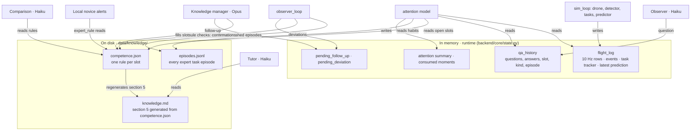

---

## 5. The agents

### 5.1 LLM agents (Claude)

| Agent | File | Model | API call | Triggered by | Input | Output (structured) | Meter label |
|---|---|---|---|---|---|---|---|
| **Apprentice observer** | [backend/llm/observer.py](backend/llm/observer.py) | Haiku 4.5 (`OBSERVER_MODEL`) | `AsyncAnthropic.messages.parse`, system prompt **cached**, `max_tokens` 400, timeout 15 s, 1 retry | `observer_loop` when the attention score ≥ 3 and every gate is open; or "Ask now" | Cached system (~4.6k tokens: role, scene, rules, full competence grid), the *moment* (why now, ≤ 3 target slots, known rules), last 5 Q&A, compact flight context, camera frame | `ObserverDecision {observation, ask_question, target_slot, question}` | `observer` |
| **Knowledge manager** | [backend/llm/knowledge_manager.py](backend/llm/knowledge_manager.py) | Opus 5.5 (`DEFAULT_MODEL`) | `beta.messages.parse`, `effort: low`, server-side fallback, `max_tokens` 600 (+8000 thinking budget), timeout 60 s | Every answer and every note (`_process_answer`) | Question, answer, target slot + what it already stores, deviation or hypothesis context, measured episode, all 29 slots | `SlotUpdate {usable, slot, rule, conditions, reason, vague, confirms_hypothesis, follow_up}` | `knowledge` |
| **Tutor** | [backend/llm/advisor.py](backend/llm/advisor.py) | Haiku 4.5 (`TUTOR_MODEL`) | `messages.parse`, `max_tokens` 300, timeout 15 s | Novice events (≥ 6 s apart), novice questions | Whole `knowledge.md`, telemetry, 3-s forecast, mission progress, event, question, camera frame | `Advice {speech, category, urgency, knowledge_reference}` | `tutor` |
| **Debrief writer** | [backend/llm/summarizer.py](backend/llm/summarizer.py) | Haiku 4.5 (`DEBRIEF_MODEL`) | `messages.parse`, `max_tokens` 700 | End of a flight, or a missing summary | Deterministic flight metrics + last 16 dialogue lines | `DebriefNarrative {key_maneuvers, operational_summary, coaching_points}` | `debrief` |
| **Comparison instructor** | [backend/llm/comparator.py](backend/llm/comparator.py) | Haiku 4.5 (`DEBRIEF_MODEL`) | `messages.parse`, `max_tokens` 900 | "Compare flights" | Expert rules, both summaries, the measured score and rating | `ComparisonNarrative {coverage_commentary, safety_commentary, hover_discipline, knowledge_adherence, key_strengths, areas_for_improvement, instructor_verdict}` | `debrief` |

Every call goes through [backend/llm/usage.py](backend/llm/usage.py):
- **Counters.** Calls, tokens, cached tokens and estimated USD, both per flight (reset at Start) and in total.
- **Prices (USD per million tokens).**
  - Haiku 4.5: input 1.00, output 5.00, cache write 1.25, cache read 0.10.
  - Opus 5.5: input 5.00, output 25.00, cache write 6.25, cache read 0.50. These are estimates written in the code, not published prices.

### 5.2 Voice services (ElevenLabs, no LLM)

| Service | Endpoint | Model | Called from | Fallback |
|---|---|---|---|---|
| Text-to-speech | `POST /v1/text-to-speech/{voice_id}` | `eleven_flash_v2_5` | `POST /elevenlabs/tts` | Browser `speechSynthesis` |
| Speech-to-text | `POST /v1/speech-to-text` | `scribe_v2` (language auto-detected) | `_transcribe()` in voice-answer / voice-advise | Type the answer |

The client is a shared `httpx2.Client` with the macOS trust store, keep-alive, a 30 s timeout and 1 connect retry.

### 5.3 Local engines (no API, no cost)

| Engine | File | Rate | Role |
|---|---|---|---|
| Drone physics | [backend/sim/drone.py](backend/sim/drone.py) | 60 Hz | Flight controller, tilt, drag, wind, GPS hold, compass interference, collisions |
| Wind | [backend/sim/wind.py](backend/sim/wind.py) | 60 Hz | Steady wind (2–6 m/s, random direction per flight) + gusts, stronger with height |
| Defect generator | [backend/sim/defects.py](backend/sim/defects.py) | at each Start | 2–3 insulator defects + 1–2 cable defects at random |
| Event detector | [backend/sim/detector.py](backend/sim/detector.py) | 60 Hz | 15 event types (§6.4) |
| Task tracker | [backend/sim/tasks.py](backend/sim/tasks.py) | 10 Hz | Which of the 10 tasks the pilot is doing; splits the flight into episodes |
| **Predictor (MPC)** | [backend/sim/predictor.py](backend/sim/predictor.py) | 10 Hz | Rolls out 9 manoeuvres over 3 s; risk, conflict, advice, road ahead, stopping distance |
| Predictive monitor | backend/sim/predictor.py | 10 Hz | Turns predictions into edge-triggered events |
| **Guardian** | backend/sim/predictor.py | 60 Hz (applies) | Overrides the sticks when a crash is predicted within 1.6 s (novice only) |
| **Attention model** | [backend/llm/attention.py](backend/llm/attention.py) | 1 Hz | Scores the moment, picks the slots to ask about |
| Rule checker | `review_episode()` in [competence_store.py](backend/storage/competence_store.py) | per finished episode | Confirms a learned rule, or flags a deviation |
| Rule induction | `hypothesis()` in competence_store.py | 1 Hz (via attention) | Turns a repeated, consistent habit into a hypothesis to confirm |
| Local tutor voice | `safety_alert`, `predictive_alert`, `coaching_hint` in advisor.py | per event / step / 15 s idle | Instant spoken alerts and coaching, no LLM |
| Usage meter | backend/llm/usage.py | per call | Token and cost accounting |

---

## 6. The simulation core (60 Hz)

### 6.1 The world ([backend/sim/scene.py](backend/sim/scene.py))

Coordinates are in metres, z is height. Heading convention: 0° = +y ("N"), 90° = +x ("E").

| Object | Where |
|---|---|
| 3 lattice towers | x = 0, 60, 120 on y = 0. Cable attachment at z = 25, crossarm at z = 27 spanning y = ±4.2, peak up to z = 30 |
| 2 cables | y = −3 and y = +3, 4 m sag at mid-span |
| 6 insulators | i1/i2 at x = 0, i3/i4 at x = 60, i5/i6 at x = 120 (y = ∓3, z = 25) |
| Road | x = 82 to 90 |
| 3 trees (trunk radius, trunk height) | (30, 9) r 2.0 h 11 · (52, −10) r 1.6 h 9 · (102, 8) r 1.8 h 13, whose canopy is ~5 m from the north cable. Each canopy is a 3 m sphere 2 m above the trunk |
| Take-off | (−10, −10) |

There are two geometry functions, and they agree point for point (tested on 36,800 points around the hazards):
- `clearances(pos)` gives the scalar distances for the HUD and the logs.
- `hazard_distances(points)` gives the same clearances, vectorised over thousands of points, for the predictor.

### 6.2 One simulation step (`_sim_step` in [backend/server.py](backend/server.py))

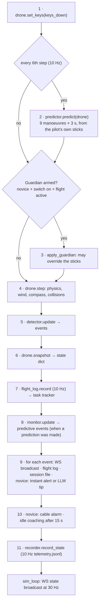

### 6.3 The drone model ([backend/sim/drone.py](backend/sim/drone.py))

- **Sticks.** The sticks command velocities in the drone's frame:
  - forward 12 m/s, strafe 8 m/s, yaw 1.2 rad/s
  - climb 5 m/s, descend 3 m/s
- **Controller.** A PI velocity loop. Its integrator learns the steady push of the wind.
- **Limits.** Horizontal acceleration is limited by a 30° tilt, and the airframe needs 0.12 s to tilt. Quadratic drag acts on airspeed, so wind pushes the drone and gusts make it wobble.
- **GPS hold.** When the sticks are released, the drone brakes, then holds its position and altitude. From full speed it stops in about 11 m.
- **Compass interference.** Within 5 m of a cable the heading drifts, so the sticks push in a slightly wrong direction.
- **Crashes.**
  - Touching a cable (< 0.45 m), a tower, a crossarm, an insulator string or a tree (airframe radius 0.35 m) is a crash.
  - Landing faster than 2.5 m/s is a "hard landing".
  - After a crash the motors stop and the drone falls.

### 6.4 Events

| Event | Source | Condition | Main consumers |
|---|---|---|---|
| `takeoff` / `land` | detector | Altitude crosses 0.4 m | tutor tip (takeoff) |
| `hover_start` / `hover_end` | detector | Speed < 0.35 m/s above 0.8 m | tutor tip if within 8 m of an insulator |
| `near_cable` | detector | Cable < 4 m (`CABLE_CAUTION_M`) | tutor tip |
| `very_close_cable` | detector | Cable < 2 m (`CABLE_DANGER_M`) | task → emergency, attention (close call), debrief violation |
| `over_road` | detector | Enters the road strip. Fields: altitude, `low` (< 20 m), traffic-check time | tutor tip |
| `road_crossed` | detector | Leaves the road strip. Fields: time over road, min altitude, mean speed, hover over road, traffic-check time, `low` | attention (road question), debrief |
| `near_tree` | detector | Tree surface < 3 m | — |
| `sudden_deceleration` | detector | Speed ≥ 3 → < 1 m/s within 1.5 s | observer context |
| `insulator_inspected` | detector | Within 3.2 m, < 0.8 m/s for 1.5 s | UI (turns green), tutor tip, debrief |
| `defect_spotted` | detector | Defect in the camera view, ≤ 4.5 m (insulator) or ≤ 6 m (cable), ≤ 1.5 m/s, for 1 s | task side-task, attention, tutor tip, debrief |
| `mission_complete` | detector | 6/6 insulators inspected | tutor tip |
| `collision` | detector | Crash | task → emergency, tutor tip, debrief |
| `compass_interference` | detector | Interference > 0.3 | attention |
| `road_ahead` | monitor | Predicted over the road within 3.5 s (once per approach, ≥ 8 s apart). Fields: time, altitude, `low`, advised action | novice alert, observer context |
| `conflict_predicted` | monitor | Risk becomes high. Fields: hazard, time, distance, action | novice alert, attention (close call) |
| `cannot_stop` | monitor | Even braking now ends inside a danger margin (speed > 2 m/s) | novice alert, attention |
| `guardian_engaged` | monitor | The Guardian takes over (novice, armed) | novice alert (always spoken), debrief |
| `defects_placed` | session start | Ground truth: the defects of this flight | debrief only (session file) |

### 6.5 Task detection ([backend/sim/tasks.py](backend/sim/tasks.py))

Every flight-log sample (10 Hz) is classified. The first matching rule wins:

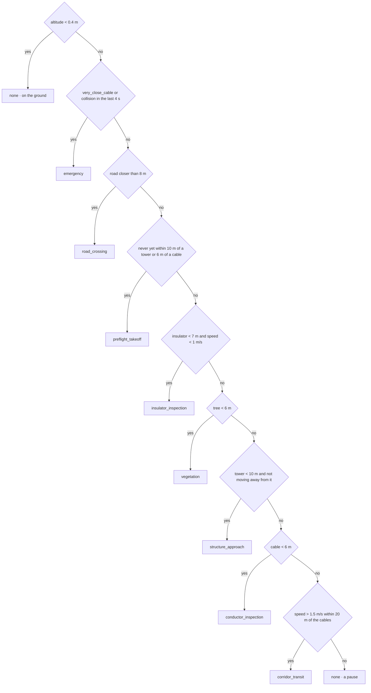

- **Side tasks** run alongside the main task, without cutting its episode:
  - `defect_assessment`: for 20 s after a `defect_spotted` event.
  - `interference_wind`: compass interference > 0.3, or wind > 5 m/s within 8 m of a cable.
- **Hysteresis.** A new task must hold for 1 s before it replaces the current one (`emergency` switches at once).
- **Episodes.** Each task period is an episode. When it ends, its **signature** is computed from the rows: duration, median speed, median/max altitude, median/min cable distance, median height relative to the cable, median insulator distance, closest tower and tree. Episodes of 2 s or more are queued for review (§8.2).

---

## 7. Predictive safety (MPC) and the Guardian

### 7.1 How it works ([backend/sim/predictor.py](backend/sim/predictor.py))

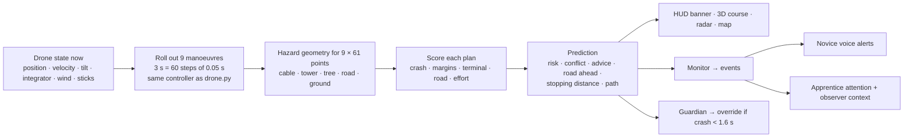

- **Faithful model.** The rollout is a vectorised copy of the simulator's flight controller: the PI loop with clamp and anti-windup, tilt and thrust limits, attitude and yaw lag (matched to the 60 Hz simulator), drag and wind.
- **Measured accuracy against the real simulator, in still air:**
  - 3 s straight ahead (~35 m flown): 0.03 m error.
  - Full-stick turn: 1.2 m.
  - Braking from 11 m/s: 10.4 m predicted vs 10.7 m real.
- **Speed.** One prediction takes about 2.7 ms.

### 7.2 The 9 candidate manoeuvres

| Key | HUD label | Spoken as | Target velocity | Effort cost |
|---|---|---|---|---|
| `pilot` | ON COURSE | — | The pilot's current sticks (turning with their yaw) | 0 |
| `slow` | SLOW DOWN | "slow down" | 35 % of the pilot's horizontal command | 1.5 |
| `brake` | BRAKE | "release the sticks and brake" | 0 horizontal, hold altitude | 2.0 |
| `climb` | CLIMB | "climb now" | Pilot's horizontal + climb 3 m/s | 2.5 |
| `brake_climb` | BRAKE + CLIMB | "brake and climb" | 0 horizontal, climb 3 m/s | 3.0 |
| `back_off` | BACK OFF | "back off" | 3.5 m/s opposite to the current motion | 4.0 |
| `strafe_left` / `strafe_right` | STRAFE LEFT/RIGHT | "move left/right" | 3.5 m/s sideways | 4.0 |
| `brake_descend` | BRAKE + DESCEND | "brake and descend" | 0 horizontal, descend 2 m/s | 4.5 |

### 7.3 Cost of a plan (lower is better)

The cost of a plan is the sum of these terms:

| Term | Value | Applies when |
|---|---|---|
| Effort | the manoeuvre's effort (table above) | always |
| Crash | 1000 + 500 · (1 − i/N) | the plan crashes at step i of N (earlier = worse) |
| Danger margins | 30 · Σ w(t) · (margin − d)² | cable < 2 m, tower or tree < 1.5 m, **only while the clearance is shrinking** |
| Caution margins | 2 · Σ w(t) · (margin − d)² | cable < 4 m, tower or tree < 3 m, only while shrinking |
| Terminal | 300 | the final velocity, extrapolated 0.5 / 1 / 1.5 s beyond the horizon, enters a danger margin. This stops "slow down" from merely pushing a crash past 3 s |
| Road | Σ over the road (3 · (20 − z)/20 + 1 if hovering) | each step spent over the road |

The weight `w(t) = 1 − 0.5·t/3` makes the near future count more.

### 7.4 Outputs

| Field | Meaning |
|---|---|
| `risk` | `high`: crash within 2 s. `medium`: crash later in the horizon, or entering a danger margin. `low`: entering a caution margin, or a low road crossing. Otherwise `none` |
| `conflict` | First danger on the pilot's course: `{hazard, in_s, dist, crash}` |
| `action` / `action_label` | Risk ≥ medium: the cheapest alternative, if it costs at least 5 less than the pilot's course. Low road crossing: `climb` if climbing clears 20 m in time, else `brake_climb` |
| `road_in_s`, `road_alt` | When and how high the drone will be over the road (ignored if a crash comes first) |
| `stop_dist`, `stop_point`, `cannot_stop` | Where the drone stops if the pilot lets go now, and whether even that ends inside a danger margin |
| `path` | The pilot's predicted course, one point every 0.25 s (13 points) |

### 7.5 The Guardian (novice mode)

- **Trigger.** The pilot's course crashes within **1.6 s** and at least one manoeuvre is crash-free.
- **What it does.** It picks the cheapest crash-free manoeuvre and writes its target velocity into the drone command, after `set_keys`, for at least **0.6 s**.
- **Re-planning.** Every 0.1 s the prediction is made again from the pilot's own sticks. If the pilot keeps pushing towards the danger, the Guardian engages again.
- **Reporting.** Each engagement:
  - emits `guardian_engaged`;
  - is spoken ("Guardian: I am taking over to brake.");
  - shows in the HUD;
  - is counted in the debrief.
- **Tested:** without the Guardian, three scenarios crash: a tower at full speed, climbing into a cable, flying into a tree. With it, all three end safe.

---

## 8. Expert mode: from a flight to a rule

### 8.1 End-to-end sequence

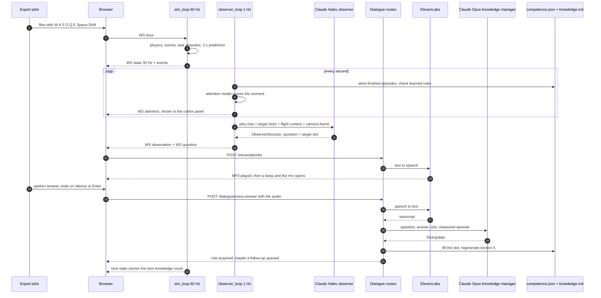

### 8.2 Step 1: every second, `observer_loop` ([backend/api/observer.py](backend/api/observer.py))

1. **`review_episodes()`**, for every finished episode of 2 s or more, in expert mode, during a flight:
   - `episode_store.append(...)` writes one line to `episodes.jsonl`;
   - `competence_store.review_episode(...)` compares it with the rules of its task (§9.4). A match adds a confirmation; a mismatch sets `pending_deviation` (once per rule per flight).
2. **`assess(t)`** runs the attention model (§8.3), giving a `Moment`.
3. **`_publish_attention`** broadcasts `attention` if the summary changed.
4. **If `_can_ask(t)`:**
   - a pending follow-up is asked as is, at a calm moment, **without any LLM**;
   - otherwise, if the moment is salient, the observer is called (§8.5).

### 8.3 Step 2: the attention model ([backend/llm/attention.py](backend/llm/attention.py))

Each reason has a weight and lists the open slots it could teach. Slots already asked during this flight are excluded.

| Reason (why now) | Trigger | Weight | Slots targeted | Kind |
|---|---|---|---|---|
| Rule contradicted | `pending_deviation` fresh (≤ 40 s) | **6.0** | that rule's slot | `deviation` |
| Road just crossed | `road_crossed` ≤ 10 s ago | **5.0** | open road-crossing slots | `rule` |
| Stopped before the road | current task `road_crossing`, speed < 1 m/s, ≥ 2 s | 4.0 | `traffic_check` first | `rule` |
| Defect just spotted | `defect_spotted` ≤ 15 s ago | **5.0** | defect-assessment slots | `rule` |
| Close call, recovered | `very_close_cable` / `conflict_predicted` / `cannot_stop` / `collision` ≤ 15 s ago, speed now < 2.5 m/s | 4.0 | emergency slots | `rule` |
| Habit seen | ≥ 2 consistent episodes for an open slot (§9.5) | 4.0 | slots with a hypothesis | `hypothesis` |
| Compass disturbed | `compass_interference` ≤ 12 s ago | 3.0 | interference & wind slots | `rule` |
| Task just finished | episode ended ≤ 8 s ago and lasted ≥ 3 s | 3.0 | that task's slots | `rule` |
| Circling / revisit | during a task of 6 s or more | 2.5 | current task | `rule` |
| Long task, no question | current task ≥ 6 s | 1.5 + min(1.5, silence/30 s) | current task | `rule` |
| Operator forced | "Ask now" | — | current or recent task | `rule` |

- **Score** = top weight + 0.25 × (number of other fresh reasons). **Claude is called only if the score is at least 3.0.**
- **Moment key.** Each moment has a key, for example `road:55`. A key that was asked about, or declined twice, never triggers again.
- **Targets.** At most **3**, taken from the 2 strongest reasons. Within a task they are ordered threshold > cue > condition > abort > assessment > procedure.

### 8.4 Step 3: the gates

| Gate | Condition |
|---|---|
| `_can_ask` | Expert mode · flight active · observer not busy · altitude > 0.4 m · ≥ 5 s of telemetry · ≥ 15 s since the last question · no unanswered question younger than 30 s · the pilot is not recording a note (or the note is older than 90 s) |
| LLM gate | API key present · score ≥ 3.0 · ≥ 4 s since the last observer call · ≥ 8 s since this moment was last tried |
| Follow-up gate (no LLM) | The drone is calm: speed < 1.5 m/s, > 2 m from cables, trees and towers, predicted risk not medium or high |

### 8.5 Step 4: the observer call (`observe_once` → `FlightObserver.decide`)

What Claude receives:

1. **System prompt (cached).** [observer.txt](backend/llm/prompts/observer.txt) plus a reference generated from [competence_grid.json](backend/llm/prompts/competence_grid.json): every task, every slot with an example question, and industry reference values. That is about 4,560 tokens, marked `cache_control: ephemeral`, so after the first call it costs 10 %.
2. **Camera frame** (optional), if it is at most 5 s old.
3. **`<moment>`.**
   - `why_now`: up to 4 reasons.
   - `targets`: slot, kind, why, example question, and for a hypothesis the observed habit.
   - `known_rules` for the tasks involved.
   - `knowledge`, e.g. "3/29".
   - For a deviation: the rule, what was expected, and what happened now.
4. **`<recent_questions_and_answers>`**: the last 5 entries.
5. **`<flight>`** ([flight_log.py](backend/sim/flight_log.py) `observer_context`):
   - `now`: the current state;
   - `last_5s`: 13 columns at 2 Hz, plus stats;
   - `events_last_5s`;
   - `flight_story`: up to 8 episodes plus the ongoing one, each with its measurements;
   - `prediction` (without the path);
   - `patterns`: revisit, circling;
   - `defects_spotted` and `totals`.

What comes back is an `ObserverDecision`. Then:
- **Discard checks.** The result is thrown away if the flight ended during the call (`session_epoch` changed), or if the pilot started a note.
- **Logging.** It is saved to `observer.jsonl` and broadcast as `observation`.
- **If it asks:**
  - the moment is consumed;
  - the question goes into `qa_history` with its slot, its kind (`rule` / `hypothesis` / `deviation` / `follow_up`), the deviation or hypothesis context, and the episode it is about;
  - the `question` message is broadcast.

### 8.6 Step 5: asking out loud and listening (browser, [VoicePanel.tsx](frontend/src/VoicePanel.tsx))

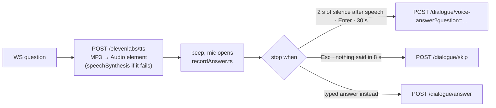

- **Silence detection.** Loudness is measured as RMS every 100 ms; speech means RMS > 0.02.
- **Mic only after a question.** The microphone is open only after a question, or while recording a note.
- **Novice alerts.** A high-urgency novice alert cancels an open recording. Other advice is shown but not spoken into the open mic.

### 8.7 Step 6: understanding the answer (`_process_answer` in [dialogue_routes.py](backend/api/dialogue_routes.py))

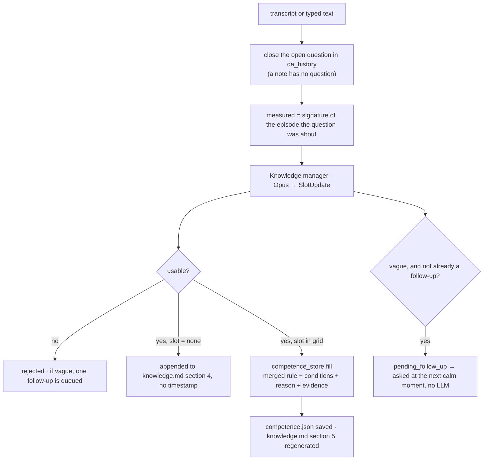

- **Evidence.**
  - If the pilot confirmed a habit, the evidence is the habit's numbers, and the slot starts as **confirmed**.
  - Otherwise it is the slot's evidence metrics, measured during the episode the question was about (only if that episode belongs to the slot's task).
- **Deviation answers** become a *condition*. The base rule and its evidence stay.
- **Transcript.** Everything goes to the session's `transcript.jsonl`, and the response tells the UI what was learned.

### 8.8 The five kinds of question, plus notes

| Kind | Produced by | Example (real outputs from the test runs) |
|---|---|---|
| `rule` | open slot + a salient moment | "Before you cross a road with traffic, what do you check, and what would make you wait?" |
| `hypothesis` | habit seen ≥ 2 times | "I noticed you held about 9 seconds in each of your last 2 insulator checks: is that your rule, and what decides that time?" |
| `deviation` | a later episode contradicts a learned rule | "Last time you stayed about 6 metres from the insulator, now about 3: what made you go in closer this time?" |
| `follow_up` | vague answer, written by the knowledge manager | "How many metres do you keep from the insulator string, and what stops you going closer?" |
| forced | "Ask now" button | The best target, or the most interesting recent behaviour |
| *note* | pilot presses **R** (or types without a question) | The pilot volunteers know-how. The apprentice holds its questions meanwhile, and the knowledge manager picks the slot |

### 8.9 Lifecycle of a question

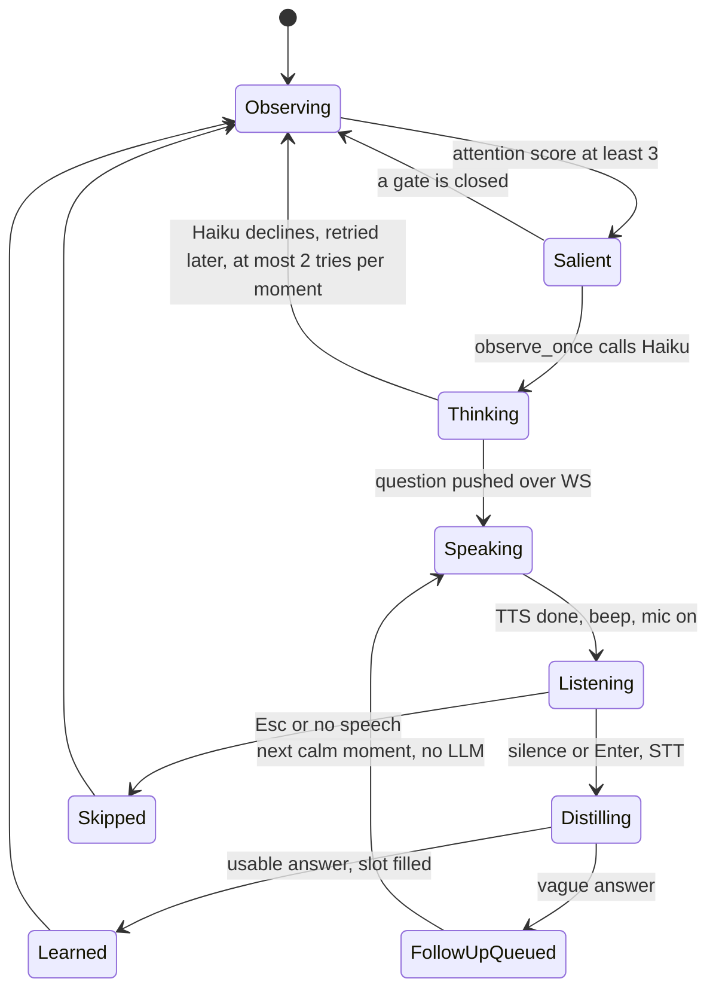

### 8.10 Worked trace: the pilot crosses the road

1. **Keys.** The pilot holds **W**: `App.tsx` → `sendKeys` → WS `keys` → `ws.py` sets `runtime.keys_down = {"w"}`.
2. **Road ahead.** `_sim_step` → `predictor.predict` sees the road 2.8 s ahead → the monitor emits `road_ahead` → broadcast, flight log, `events.jsonl`.
3. **Crossing.** The detector emits `over_road`, then `road_crossed` with the crossing stats. The task tracker ran a `road_crossing` episode, which now ends and is queued.
4. **Review.** Within 1 s, `review_episodes` stores the episode in `episodes.jsonl` and checks any learned crossing rule.
5. **Attention.** `road_crossed` is ≤ 10 s old and road slots are open, so the score is 5.0. The cortex panel shows "the pilot just crossed the road at 26 m and 8 m/s".
6. **Question.** The gates are open, so Haiku is called with the moment. It returns a question targeting `road_crossing.traffic_check`, which goes out as WS `question`.
7. **Speech and answer.** In the browser: TTS → spoken → beep → the pilot answers "I stop before the road and look both ways for trucks…" → `POST /dialogue/voice-answer`.
8. **Learning.** Backend: STT → `_process_answer` → Opus fills `traffic_check` with "Before crossing a road, stop short of it and look both ways for traffic…" → `competence.json` + `knowledge.md` section 5.
9. **UI update.** "Rule acquired" card. The next WS `state` has knowledge 4/29, and the HUD ring grows.
10. **Next novice flight.** `road_ahead` → `predictive_alert` speaks the warning and quotes the expert rule in `knowledge_reference`.

---

## 9. The knowledge model

### 9.1 The competence grid ([backend/llm/prompts/competence_grid.json](backend/llm/prompts/competence_grid.json))

The grid has 10 tasks and 29 slots. The tasks, slots and reference values come from industry sources (listed in the JSON).
- Slot ids are `task.slot`.
- **Evidence** marks the metrics that the rule checks compare on later flights.

| Task (`id` · short name) | Slots (`id` · type · evidence) |
|---|---|
| `preflight_takeoff` · Take-off & overview | `go_no_go` condition · `route_plan` procedure · `overview_climb` procedure [altitude_max] |
| `corridor_transit` · Transit along the line | `transit_position` threshold [cable_dz, cable_dist] · `transit_speed` threshold [speed] · `sag_following` procedure [cable_dz] |
| `structure_approach` · Tower approach | `approach_path` procedure [speed, cable_dz] · `structure_check` cue · `structure_clearance` threshold [pylon_dist_min] |
| `insulator_inspection` · Insulator inspection | `viewpoints` procedure · `inspection_standoff` threshold [insulator_dist, cable_dz] · `defect_cues` cue · `dwell` threshold [duration] |
| `conductor_inspection` · Cable inspection | `scan_technique` procedure [cable_dist, cable_dz, speed] · `conductor_cues` cue · `zoom_trigger` condition |
| `defect_assessment` · Defect assessment | `confirmation` procedure · `severity` assessment · `report_content` procedure |
| `interference_wind` · Interference & wind | `emi_response` condition · `emi_distance` threshold · `wind_side` condition |
| `road_crossing` · Road crossing | `crossing_rule` procedure [altitude, speed] · `traffic_check` cue |
| `vegetation` · Vegetation | `tree_clearance_flight` threshold [tree_dist_min] · `encroachment_check` assessment |
| `emergency` · Emergency | `abort_triggers` abort · `escape_manoeuvre` procedure · `return_landing` procedure |

### 9.2 One slot entry (`data/knowledge/competence.json`)

```json
"insulator_inspection.inspection_standoff": {
  "rule": "When inspecting an insulator string, hold about 5 to 6 m away and a bit above the cable; do not go closer, because the compass goes crazy near the line.",
  "conditions": ["With no wind, you may go closer to the string to see small cracks on the discs."],
  "reason": "compass interference and gusts",
  "confidence": "confirmed",
  "confirmations": 2,
  "evidence": {"insulator_dist_median": 5.7, "cable_dz_median": 1.0},
  "learned_in": {"session": "expert-c5e53922", "t": 30.0},
  "induced": false,
  "answers": [{"q": "…", "a": "…"}]
}
```

Only the last 3 question/answer pairs are kept in `answers`.

### 9.3 Lifecycle of a slot

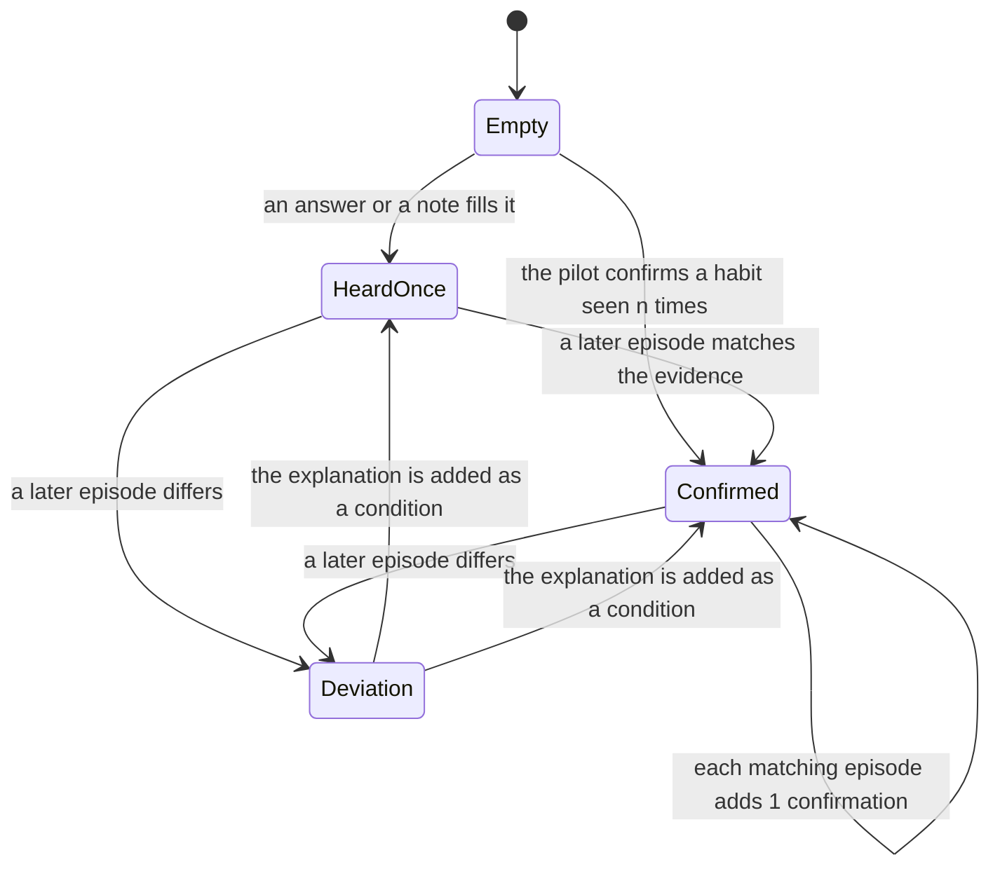

In the code, `confidence` is `"once"` or `"confirmed"`. A deviation keeps the confidence and adds a condition.

### 9.4 Rule checks on later episodes

A later episode of the same task is compared with each slot that has evidence. It **matches** if every metric is within tolerance:

| Metric family | Tolerance |
|---|---|
| `duration_s` | ± max(3 s, 100 %), i.e. within a factor of 2 |
| speeds | ± max(0.8 m/s, 35 %) |
| altitudes | ± max(3 m, 25 %) |
| distances and height relative to the cable | ± max(1.5 m, 30 %) |

- The episode the rule was learned from is never checked against it.
- A deviation is asked about at most once per rule per flight.

### 9.5 Rule induction (hypotheses)

- **When.** An empty slot has evidence metrics, and the expert flew that task at least **2** times (any flights, last 12 episodes from `episodes.jsonl`).
- **Test.** Every value must be within the tolerance above of the median.
- **Result.** A hypothesis with:
  - a text, e.g. "In 3 insulator inspections the pilot held about 6 metres from the insulator and stayed about 1 metre above the cable.";
  - a second-person example question;
  - the median evidence.
- **On confirmation.** If the pilot confirms (the knowledge manager sets `confirms_hypothesis`), the slot is stored as **confirmed**, with `confirmations = n − 1` and `induced: true` (◆ in the UI).

### 9.6 `knowledge.md`, what the tutor reads

- **Sections 1–4.** Section 4 ("Operator Insights Log") holds answers that fit no slot. The other sections are a hand-written baseline from [knowledge_store.py](backend/storage/knowledge_store.py).
- **Section 5, "Expert Competence Grid".** Regenerated from `competence.json` at every change. It lists each rule with its status, its conditions and its measured evidence. Anything written after section 5 is preserved.
- **The tutor reads the whole file**, and its prompt says section 5 wins on any disagreement.

---

## 10. Novice mode: coaching and protection

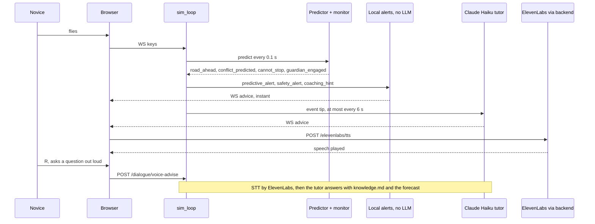

### 10.1 Who speaks, by priority

| Priority | Voice | Source | Rule |
|---|---|---|---|
| 1 | Guardian take-over: "Guardian: I am taking over to brake." | `predictive_alert` (local) | Always spoken |
| 2 | Predicted danger: "You will hit a tree in 2 seconds: release the sticks and brake!" / "Too fast: … you cannot stop before the tower." / "Road ahead in 3 seconds and you are only 12 metres up: brake and climb." | `predictive_alert` (local) | Instant. Repeated at most every 4 s unless it escalates to high urgency |
| 3 | Cable alarm: "Danger! Cable 1.6 metres away. Climb now." | `safety_alert` (local): cable < 2 m, or closing > 1.5 m/s within 4 m | Same as 2 |
| 4 | Event tip (LLM) | Tutor on `takeoff`, `near_cable`, `over_road`, `hover_start` (within 8 m of an insulator), `insulator_inspected`, `defect_spotted`, `mission_complete`, `collision` | ≥ 6 s apart. Dropped if an alert was spoken meanwhile, or if the flight ended |
| 5 | Idle coaching: "Next, insulator i3, about 40 metres ahead to your left… [expert rule]" | `coaching_hint` (local) | After 15 s without advice |
| 6 | Answer to the pilot's question (LLM) | Tutor | On request (typed, or R) |

In local alerts, `knowledge_reference` quotes the expert's learned rule when one exists, e.g. "Expert rule: When crossing a road, climb to at least 25 m…".

### 10.2 Worked trace: flying at a tree

1. The novice flies at 9 m altitude towards the tree at (52, −10).
2. **Danger predicted.** `predict` sees a crash with the tree in 2.0 s: `risk = high`, so the monitor emits `conflict_predicted {hazard: tree, in_s: 2.0, action: brake}`.
3. **Warning.** The alert "You will hit a tree in 2 seconds: release the sticks and brake!" goes out as WS `advice`. The HUD banner shows "COLLISION RISK · TREE · in 2.0 s · BRAKE", and the predicted path turns red in 3D, on the radar and on the map.
4. **Guardian.** 0.4 s later the crash is ≤ 1.6 s away: `guardian_engaged`, the intervention counter goes up, the take-over is announced, and `apply_guardian` brakes for ≥ 0.6 s. No crash.
5. **Debrief.** "1 predicted conflict, 1 Guardian save". The comparison deducts 8 points per intervention.

---

## 11. Debrief and comparison

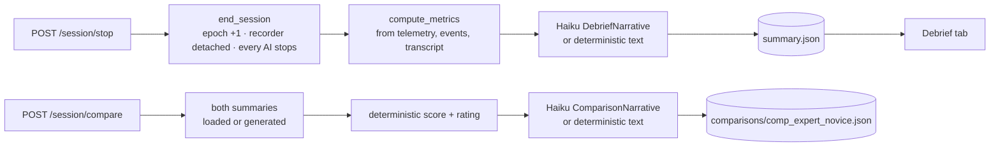

- **Metrics.** All of these are deterministic; the LLM never writes a number:
  - duration, coverage %, insulators inspected
  - min cable distance, violations (cable < 2 m, collisions), time inside the cable danger margin
  - max speed overall and near structures
  - hover stability /10 (from the drift while the GPS hold is on)
  - defects found and missed (against `defects_placed`)
  - road crossings and low crossings (< 20 m), predicted conflicts, too-fast-to-stop warnings, Guardian interventions
  - questions asked, answers, notes, rules learned (slot names)
  - tutor messages and AI usage.
- **Comparison score.**
  - Start at 100, then subtract: 12 per insulator the expert inspected and the novice missed, 15 per violation, 8 per Guardian intervention, 5 per low road crossing, 4 per defect missed, and 10 if the min cable distance is below 2 m.
  - The result is clamped to 5–100.
  - **Rating:** *Excellent* if there are no violations, the min cable distance is ≥ 2 m and the Guardian never intervened; *Satisfactory* if there are ≤ 2 violations; otherwise *Requires Retraining*.

---

## 12. Frontend

### 12.1 Components

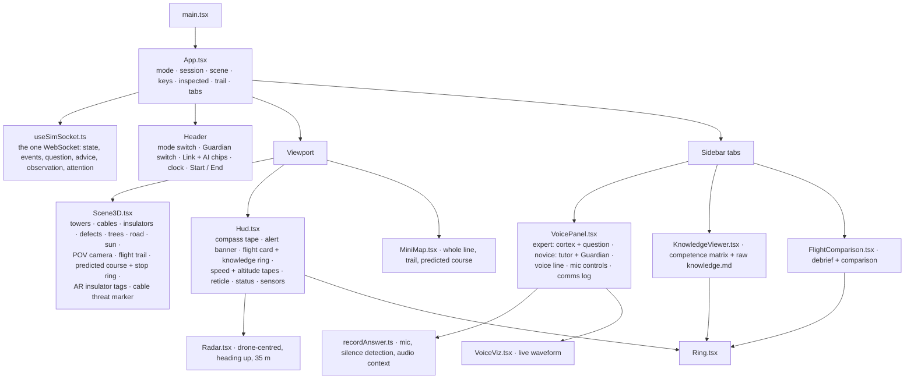

### 12.2 Data flow in the browser

- **Live data.** `useSimSocket` receives everything live and hands it to `App`, which passes it down as props.
- **REST.** Calls are made directly by the component that needs them (Start/End in `App`, answers in `VoicePanel`, the grid in `KnowledgeViewer`, debriefs in `FlightComparison`).
- **Inspected insulators.** `App` keeps the set from `insulator_inspected` events, which turns them green in 3D, on the radar, on the map and in the status pips.
- **Camera frames.** Every 2 s, `App` copies the WebGL canvas into a ≤ 768 px JPEG and sends it over WS.
  - Only the 3D scene is in the frame. The HUD, the AR tags and the panels are DOM elements, so the AI never sees them.
  - The scene's own overlays (orange trail, cyan predicted course) are described to the observer in its prompt.
- **Start Flight.** It unlocks audio and asks for mic permission (`primeMicrophone`), sends the Guardian setting, then starts the session.

### 12.3 Controls

| Key | Action |
|---|---|
| W / S | Forward / back (12 m/s) |
| A / D | Strafe left / right (8 m/s) |
| Q / E | Yaw left / right |
| Space / Shift | Climb (5 m/s) / descend (3 m/s) |
| R | Expert: record a note · Novice: ask the tutor by voice |
| Enter / Esc | While the mic is open: finish / discard |

Recording limits ([recordAnswer.ts](frontend/src/recordAnswer.ts)):

| Recording | Stops after this much silence | Gives up if nothing is said | Maximum |
|---|---|---|---|
| Answer | 2 s | 8 s | 30 s |
| Note | 4 s | 10 s | 60 s |

---

## 13. Data on disk

```text
data/                                   (ROBOT_APPRENTICE_DATA_DIR)
├── knowledge/
│   ├── knowledge.md        written by knowledge_store (sections 1-4) + competence_store (section 5) · read by the tutor and the Knowledge tab · tracked by git
│   ├── competence.json     written by competence_store (rules) · read by attention, observer prompt, knowledge manager, local alerts, comparison, HUD ring
│   └── episodes.jsonl      written by episode_store (every expert task episode) · read by attention (habits)
├── sessions/<mode>-<8 hex>/          (git-ignored)
│   ├── meta.json           mode, start and stop time
│   ├── telemetry.jsonl     full state at 10 Hz
│   ├── events.jsonl        every event, including defects_placed
│   ├── transcript.jsonl    questions, answers, notes, tutor messages (with slot and kind)
│   ├── observer.jsonl      every observer decision (why now, question or not) and every rule check
│   ├── frames/             JPEGs, only when the REST frame route is used
│   └── summary.json        the debrief
└── comparisons/
    └── comp_<expert>_<novice>.json
backend/llm/prompts/        observer.txt · knowledge_builder.txt · advisor.txt · summarizer.txt · comparator.txt · competence_grid.json
```

`competence.json` and `episodes.jsonl` are not git-ignored. A commit shares the apprentice's knowledge with the team.

---

## 14. Every rate, threshold and timeout

| What | Value | Where |
|---|---|---|
| Physics step | 60 Hz, paced on the wall clock, ≤ 4 catch-up steps | `SIM_HZ`, server.py |
| Prediction | 10 Hz, 3 s horizon, 0.05 s steps | `PREDICT_HZ`, `PREDICT_HORIZON_S` |
| State broadcast | 30 Hz | `BROADCAST_HZ` |
| Flight log + session telemetry | 10 Hz | `RECORD_HZ`, session_recorder |
| Attention tick | 1 s | `OBSERVER_TICK_S` |
| Observer LLM, min gap | 4 s | `OBSERVER_INTERVAL_S` |
| Question cooldown | 15 s | `QUESTION_COOLDOWN_S` |
| Unanswered question blocks for | 30 s | `UNANSWERED_QUESTION_TIMEOUT_S` |
| Ask threshold | 3.0 | attention.py |
| Declined moment retried after | 8 s, max 2 tries | api/observer.py |
| Follow-up valid for | 60 s | api/observer.py |
| Deviation valid for | 40 s | api/observer.py |
| Pilot note blocks questions for | ≤ 90 s | api/observer.py |
| Camera frame | every 2 s, used if ≤ 5 s old | App.tsx, `OBSERVER_FRAME_MAX_AGE_S` |
| Task switch hysteresis | 1 s (emergency: immediate) | tasks.py |
| Episode reviewed if longer than | 2 s | tasks.py |
| Cable danger / caution | 2 m / 4 m | `CABLE_DANGER_M`, `CABLE_CAUTION_M` |
| Tower or tree danger / caution | 1.5 m / 3 m | `STRUCTURE_*` |
| Road minimum crossing height | 20 m (until the expert teaches theirs) | `ROAD_MIN_CROSSING_ALT_M` |
| Guardian trigger / hold | crash ≤ 1.6 s / ≥ 0.6 s | predictor.py |
| Road warning | ≤ 3.5 s ahead, ≥ 8 s apart | predictor.py |
| Novice tip gap / alert repeat / idle coaching | 6 s / 4 s / 15 s | server.py |
| Claude timeouts | observer 15 s · tutor 15 s · knowledge + debrief 60 s · 1 retry | observer.py, client.py |
| ElevenLabs timeout | 30 s, 1 connect retry | dialogue_routes.py |

---

## 15. Cost control

**Why the AI is cheap.** Six choices keep it cheap:
1. **Local first.** Physics, prediction, the Guardian, task detection, rule checks, habit induction, attention, follow-ups, alerts and idle coaching cost nothing.
2. **The observer is called only for salient moments,** not on a timer. Before this design, one 466 s flight made 111 observer calls and asked a single question.
3. **Prompt caching.** The 4.6k-token system prompt is cached, so each later call pays 10 % for it.
4. **Compact context.** The flight story (episodes and their measurements) replaces raw coordinate dumps. The telemetry window is 13 columns at 2 Hz.
5. **The right model for each job.** Haiku 4.5 for frequent calls (observer, tutor, debrief), Opus 5.5 only where knowledge quality matters (one call per answer).
6. **Visible meter.** The header chip and the HUD show calls and dollars for the current flight, and `GET /ai/usage` gives the totals.

**Measured in the end-to-end test runs:**
- **Observer call:** about 1.4–1.9k fresh input tokens + ~4.9k cached + ~90 output tokens, ≈ **$0.003**.
- **Knowledge-manager call** (Opus, estimated price): ≈ **$0.02**.
- **A full flight with 2 answered questions:** ≈ **$0.05**.

---

## 16. When things fail

| Failure | What happens |
|---|---|
| No Anthropic key | No questions. Answers come back `rejected` with an error. Tutor falls back to rule-based advice. Debrief and comparison use deterministic text. Everything else works |
| No ElevenLabs key | TTS → the browser voice. STT → 503: type the answer |
| Network or TLS error (e.g. a venue Wi-Fi intercepting HTTPS) | ElevenLabs: 502 with the reason, shown in the comms log. Claude: the error is logged, and the loops keep running |
| Flight ended during an AI call | The result is discarded (`session_epoch` changed) |
| Pilot started a note during an observer call | The question is dropped |
| Haiku declines | The moment can be retried once, 8 s later |
| No structured output | Knowledge manager: rejected with an error. Tutor, debrief and comparison: deterministic fallbacks |
| Simulation loop exception | Logged. The loop resumes after 50 ms |

---

## 17. Tests

- **Backend:** `.venv/bin/python -m pytest` (config in [pytest.ini](pytest.ini), suite in [backend/tests/](backend/tests/)) runs 32 tests in ~4 s. It needs no API key and no network, and works on a throw-away data folder.

| File | What it proves |
|---|---|
| test_scene.py | The vectorised hazard geometry matches `collision()` on thousands of points around every hazard; distances, road and trees; scene JSON |
| test_drone.py | Braking distance from full speed, GPS hold in still air, a crash into a cable |
| test_predictor.py | The predicted path matches the simulator (< 0.3 m at 3 s); stopping distance (< 1.5 m error); the Guardian prevents 3 crashes that happen without it; the advice is "brake", not "slow down"; the low road crossing is announced once, with a climb |
| test_tasks.py | Take-off → approach → inspection; leaving a tower is not an approach; the pause before the road, then the crossing |
| test_knowledge.py | Fill + markdown section, confirmations, deviations, hypotheses, confirmed habits, episodes counted once |
| test_attention.py | Road crossing → road question (asked once); a pause → nothing; deviation first; habit → hypothesis |
| test_advisor_and_log.py | Alert texts, cable alarm, coaching, compact observer context |
| test_api.py | Scene, health, grid; full flight lifecycle with a note and a debrief; the Guardian switch |

- **Frontend:** `cd frontend && npx tsc --noEmit` type-checks the whole app.

---

## 18. Leftovers and known gaps

- **Unused files, kept on purpose.** These are not imported by the running app: `backend/expert.py`, `backend/guardrails.py`, `backend/recorder.py`, `backend/workmap.py`, `frontend/src/WorkMap.tsx`.
- **Unused variables.** `.env` contains `VITE_ELEVENLABS_AGENT_ID` and `VITE_ELEVENLABS_TUTOR_AGENT_ID`, left over from the removed ElevenLabs agent. Nothing reads them, but being `VITE_`, they would be bundled into the public JS.
- **Out-of-date example.** `.env.example` shows `OBSERVER_INTERVAL_S=3.0` from the old polling design. It now means "minimum gap between two observer calls", and the code default is 4.0.
- **Frames are not saved.** The app sends camera frames over WebSocket, which only updates the live frame. The `frames/` folder fills only through the REST frame route.
- **Missing dependency.** `pytest` is not in `backend/requirements.txt`; it was installed in `.venv` by hand.
- **numpy on Python 3.14.** Use numpy ≥ 2.3. numpy 1.26 on Python 3.14 silently corrupts large array arithmetic. It was found and fixed in this repo's venv, which now has numpy 2.5.
- **One shared drone.** One flight at a time, shared by every open tab.

---

## 19. Glossary

| Term | Meaning |
|---|---|
| **Task** | What the pilot is doing, one of 10 (take-off, transit, tower approach, insulator inspection, cable inspection, defect assessment, interference & wind, road crossing, vegetation, emergency) |
| **Episode** | One continuous period of a task, with its measured *signature* |
| **Slot** | One piece of know-how a task needs (e.g. insulator inspection → inspection distance). 29 in total |
| **Evidence** | The measured numbers attached to a rule, used to check it on later flights |
| **Moment** | What the attention model found worth asking about now: reasons, score, target slots |
| **Hypothesis** | A habit seen at least twice, proposed to the expert as a rule to confirm |
| **Deviation** | A later episode that contradicts a learned rule; the apprentice asks what changed |
| **Follow-up** | One extra question after a vague answer, asked without an LLM call |
| **Note** | Know-how the expert volunteers on their own (R) |
| **Coverage** | Slots filled / 29, and how many are confirmed in flight |
| **MPC** | Model-predictive control: simulate the next seconds for several manoeuvres, pick the best, re-plan every step |
| **Guardian** | The MPC acting on the sticks for a moment, in novice mode, when a crash is imminent |
| **Epoch** | A counter bumped at every Start/End; AI results from an older epoch are thrown away |
| **runtime** | The single in-memory object holding the whole live state of the backend |
