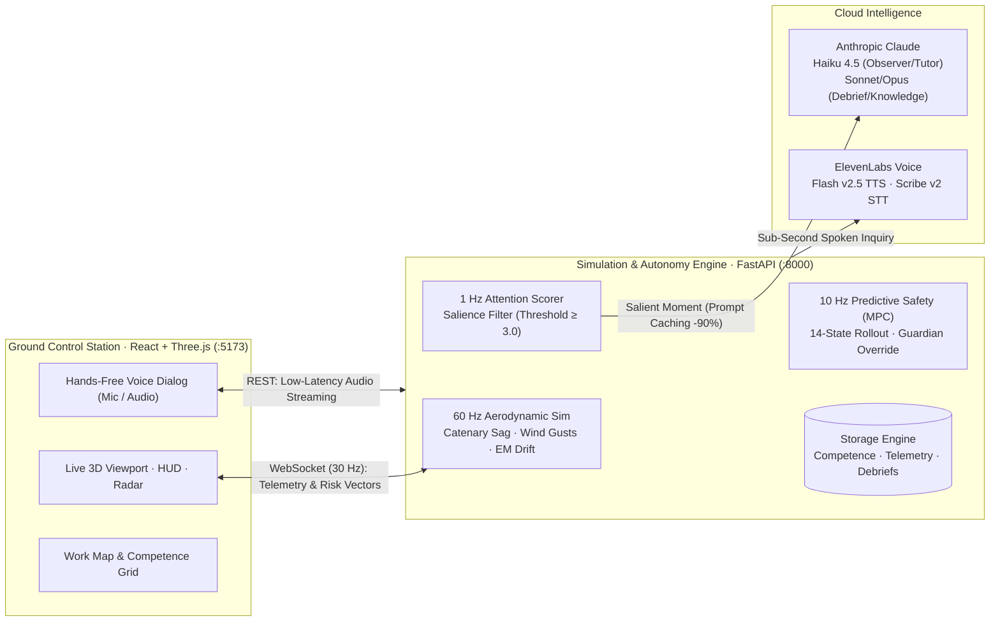

# Power Line AI Apprentice

> **Autonomous Tacit Know-How Capture, Real-Time Model Predictive Safety, and AI Coaching for Critical Infrastructure Drone Inspection.**

[](https://python.org)
[](https://fastapi.tiangolo.com)
[](https://react.dev)
[](https://threejs.org)
[](https://anthropic.com)
[](https://elevenlabs.io)
[]()
[]()

---

## Executive Summary

High-voltage power transmission inspection by Unmanned Aerial Systems (UAS) is high-stakes: flights operate centimeters from energized conductors, subject to catenary wire sway, aerodynamic lattice turbulence, and electromagnetic compass drift. 

Utilities face an urgent **knowledge crisis**: veteran inspection pilots hold decades of unwritten, instinctive heuristics (approach vectors, sag compensation, vortex avoidance) that flight manuals cannot convey. As these experts retire, institutional memory vanishes, leaving novice pilots vulnerable to fatal tower strikes and catastrophic grid outages.

**Power Line AI Apprentice** bridges this divide with an intelligent Ground Control Station (GCS) and 60 Hz physics digital twin:
1. **Expert Mode (Know-How Capture)**: The AI passively observes veteran flights, using a local attention filter to trigger low-latency spoken inquiries via ElevenLabs voice at key moments. It extracts and codifies tacit heuristics into a structured **29-Slot Competence Grid**.
2. **Novice Mode (AI Coaching & MPC Guardian)**: Novice pilots receive real-time voice coaching grounded in verified expert rules, backed by a **10 Hz Sampling-Based Model Predictive Control (MPC) Guardian** that forecasts collision trajectories and autonomously overrides controls if a crash is imminent ($t_{\text{crash}} \le 1.6\,\text{s}$).
3. **Automated Debrief & Comparative Analytics**: Evaluates flight compliance, safety margins, and generates 3D trajectory comparison overlays (Expert baseline vs. Novice flight).

---

## System Architecture



*For complete mathematical proofs, 14-state kinematic formulations, and sequence diagrams, refer to [PIPELINE.md](PIPELINE.md).*

---

## Key Capabilities

### 1. Tacit Know-How Capture (Expert Mode)
- **Local Salience Filter (1 Hz)**: Flight telemetry is evaluated locally against kinematic triggers (abrupt decelerations, close hovers, road crossings, non-standard angles). Claude is invoked only when salience $\ge 3.0$, eliminating pilot fatigue and cutting API overhead by >80%.
- **Ephemeral Prompt Caching**: The 4.6k-token Competence Grid prompt is tagged with Anthropic's `cache_control: {"type": "ephemeral"}`, slashing input token costs by **90%**.
- **Hands-Free Spoken Interaction**: Spoken questions delivered via ElevenLabs Flash v2.5 (`< 150 ms` latency). Pilot voice answers are captured via microphone with Voice Activity Detection (VAD) and transcribed with ElevenLabs Scribe v2.
- **Rule Distillation**: Converts unstructured voice observations into structured heuristic rules (`condition -> action -> reason`), mapped with telemetry evidence to the **29-Slot Competence Grid**.

### 2. Autonomous Predictive Safety (Novice Mode)
- **Sampling-Based Receding Horizon MPC (10 Hz)**: Evaluates 9 candidate maneuvers (`pilot`, `slow`, `brake`, `climb`, `brake_climb`, `back_off`, `strafe_left`, `strafe_right`, `brake_descend`) over a $3.0\,\text{s}$ forward horizon ($N = 60$ steps at $\Delta t = 0.05\,\text{s}$).
- **14-Dimensional Kinematic Dynamics**: Propagates position $p$, velocity $v$, rotor acceleration $a^{\text{thrust}}$, yaw $\psi$, yaw rate $\dot{\psi}$, and PI velocity integrator state $I$, factoring in aerodynamic drag and wind vectors.
- **Receding Horizon Guardian**: If the pilot's trajectory projects a collision within $t_{\text{crash}} \le 1.6\,\text{s}$, the Guardian takes over, applying the cost-minimal safe escape vector for at least $0.6\,\text{s}$ until safety margins are recovered.
- **Real-Time HUD Warning Vectors**: Visualizes forward collision cones, distance-to-wire clearances, and speed envelopes directly in the 3D viewport.

### 3. Photorealistic 60 Hz Digital Twin
- **Catenary Wire Physics**: Dynamic conductor catenary curves between lattice towers, incorporating temperature sag and wind deflection.
- **Electromagnetic Compass Drift**: Simulates high-voltage magnetic distortion within $5.0\,\text{m}$ of conductors, destabilizing the magnetometer and forcing pilots to rely on visual cues.
- **Micro-Meteorology**: Height-dependent wind shear, steady crosswinds, and sudden stochastic wind gusts.
- **Defect Inspection Tasks**: Procedural insulator faults (flashover burns, cracked ceramic discs, contamination) that pilots must approach, identify, and document.

---

## The 29-Slot Competence Grid

The apprentice organizes domain know-how into 10 core inspection phases across 29 structured slots:

| Task Domain | Measured Telemetry | Competence Slots |
|---|---|---|
| **1. Take-Off & Overview** | Climb rate, max altitude, launch point | `go_no_go`, `route_plan`, `overview_climb` |
| **2. Corridor Transit** | Transit speed, height, wire offset | `transit_position`, `transit_speed`, `sag_following` |
| **3. Tower Approach** | Approach velocity, deceleration point, clearance | `approach_path`, `structure_check`, `structure_clearance` |
| **4. Insulator Inspection** | Hover stability, inspection angle, distance | `inspection_position`, `defect_scan`, `wind_hold` |
| **5. Line Crossing** | Crossing clearance, clearance over/under wire | `crossing_point`, `crossing_height`, `conductor_sight` |
| **6. Road Crossing** | Ground speed, crossing altitude | `traffic_watch`, `crossing_speed`, `minimum_altitude` |
| **7. Wind Compensation** | Crab angle, attitude tilt, drift recovery | `gust_reaction`, `leeward_buffer`, `wind_abort` |
| **8. Defect Investigation** | Multi-angle orbit radius, lighting angle | `approach_angle`, `lighting_check`, `evidence_shot` |
| **9. Sensor Interference** | Heading discrepancy, GPS lock | `drift_recognition`, `manual_fallback` |
| **10. Emergency Abort** | Escape trajectory, battery reserve | `abort_trigger`, `escape_vector`, `failsafe_landing` |

---

## Project Structure

```text
.
├── backend/
│   ├── api/                     # FastAPI HTTP & WebSocket endpoints
│   │   ├── debrief_routes.py    # Post-flight analysis & scoring
│   │   ├── dialogue_routes.py   # Spoken Q&A, voice answers & TTS
│   │   ├── knowledge_routes.py  # Competence grid REST routes
│   │   ├── observer.py          # Real-time observer orchestration
│   │   ├── session_routes.py    # Session management & telemetry replay
│   │   └── ws.py                # 30 Hz real-time state broadcast
│   ├── core/                    # Core configuration & shared state
│   │   ├── config.py            # Parameters, safety thresholds & model IDs
│   │   └── state.py             # Active runtime session state
│   ├── llm/                     # Anthropic Claude orchestration
│   │   ├── advisor.py           # Real-time novice coaching engine
│   │   ├── attention.py         # 1 Hz local heuristic salience filter
│   │   ├── client.py            # Anthropic client wrapper with fallback aliasing
│   │   ├── debrief.py           # Post-flight scoring & automated report
│   │   ├── observer.py          # Structured Q&A observer with prompt caching
│   │   └── prompts/             # System prompts & competence_grid.json
│   ├── sim/                     # 60 Hz physics & safety engines
│   │   ├── drone.py             # Flight dynamics, PID autopilot, EM drift
│   │   ├── flight_log.py        # Flight telemetry logging & pattern detection
│   │   ├── predictor.py         # 10 Hz Sampling-Based MPC & Guardian
│   │   ├── scene.py             # 3D world geometry, towers, catenary cables
│   │   └── wind.py              # Atmospheric wind shear & gust model
│   ├── storage/                 # Persistence layer (JSON / JSONL / Markdown)
│   │   ├── competence_store.py  # 29-slot Competence Grid storage
│   │   └── session_recorder.py  # Telemetry, audio & observer logs
│   ├── requirements.txt         # Python dependencies
│   └── server.py                # FastAPI application entrypoint
├── data/                        # Persistent flight records & knowledge
│   ├── knowledge/               # competence.json & knowledge.md
│   └── sessions/                # Telemetry (.jsonl), frames & debriefs
├── frontend/                    # Ground Control Station (React + Three.js)
│   ├── src/
│   │   ├── App.tsx              # Main GCS dashboard container
│   │   ├── Hud.tsx              # Real-time flight instruments & risk alarms
│   │   ├── Scene3D.tsx          # Three.js 3D viewport & hazard vectors
│   │   ├── VoicePanel.tsx       # Hands-free audio interface
│   │   ├── KnowledgeViewer.tsx  # Interactive Competence Grid inspector
│   │   ├── FlightComparison.tsx # Expert vs. Novice trajectory comparison
│   │   └── useSimSocket.ts      # WebSocket state manager
│   ├── package.json             # Frontend dependencies
│   └── vite.config.ts           # Vite build configuration
├── PIPELINE.md                  # In-depth mathematical MPC & pipeline architecture
└── README.md                    # Project documentation
```

---

## Quickstart Guide

### Prerequisites
- **Python 3.11+**
- **Node.js 18+** and **npm**
- Anthropic API key & ElevenLabs API key

---

### Step 1: Clone & Configure Environment

```bash
git clone https://github.com/your-org/Hackathon-Hacknation.git
cd Hackathon-Hacknation

# Create .env from template
cp .env.example .env
```

Edit `.env` with your API credentials:
```bash
ANTHROPIC_API_KEY=sk-ant-api03-...
ELEVENLABS_API_KEY=sk_...
ELEVENLABS_VOICE_ID=21m00Tcm4TlvDq8ikWAM   # Rachel (or custom voice ID)

# Model configuration
OBSERVER_MODEL=claude-haiku-4-5-20251001   # Fast, cost-efficient observer
TUTOR_MODEL=claude-haiku-4-5-20251001      # Real-time novice coach
DEBRIEF_MODEL=claude-sonnet-5-5            # High-capability debrief analysis
```

---

### Step 2: Install Dependencies

**Backend:**
```bash
python3 -m venv .venv
source .venv/bin/activate
pip install -r backend/requirements.txt
```

**Frontend:**
```bash
cd frontend
npm install
cd ..
```

---

### Step 3: Run the Application

**Terminal 1 — Backend API & Simulation Engine:**
```bash
source .venv/bin/activate
uvicorn backend.server:app --reload --port 8000
```
*Backend runs on `http://localhost:8000` with WebSocket at `ws://localhost:8000/ws`.*

**Terminal 2 — Frontend Ground Control Station:**
```bash
cd frontend
npm run dev
```
*Open `http://localhost:5173` in your browser.*

---

## Flight Controls

The GCS supports standard drone stick commands via keyboard:

| Control | Key | Action |
|---|---|---|
| **Pitch** | `W` / `↑` / `S` / `↓` | Move Forward / Backward |
| **Roll (Strafe)** | `A` / `D` | Strafe Left / Right |
| **Yaw** | `Q` / `←` / `E` / `→` | Rotate Heading Left / Right |
| **Throttle** | `Space` / `Shift` | Climb / Descend |
| **Voice Q&A** | `Enter` / `Esc` | Finish vocal answer / Skip question |

---

## Deployment (Render)

A production blueprint is pre-configured in [render.yaml](render.yaml):
1. In Render, select **New > Blueprint** and link this repository.
2. Provide `ANTHROPIC_API_KEY` and `ELEVENLABS_API_KEY` as environment secrets.
3. The blueprint automatically provisions:
   - `robot-apprentice-api`: FastAPI backend web service.
   - `robot-apprentice-frontend`: Static Vite/React distribution.

---

## Technical Deep-Dive

For a rigorous mathematical breakdown of the control theory and predictive pipeline:
- **Kinematic State Space Formulation**: See [PIPELINE.md § 4.1](PIPELINE.md#41-state-space--system-dynamics).
- **Candidate Maneuver Library & Closed-Loop Rollouts**: See [PIPELINE.md § 4.2](PIPELINE.md#42-candidate-action-library-mathcalu).
- **Multi-Objective Cost Optimization & Barrier Potentials**: See [PIPELINE.md § 4.3](PIPELINE.md#43-objective-function-cost-minimization).
- **Receding Horizon Safety Interlock (Guardian)**: See [PIPELINE.md § 4.4](PIPELINE.md#44-receding-horizon-safety-interlock-guardian).
